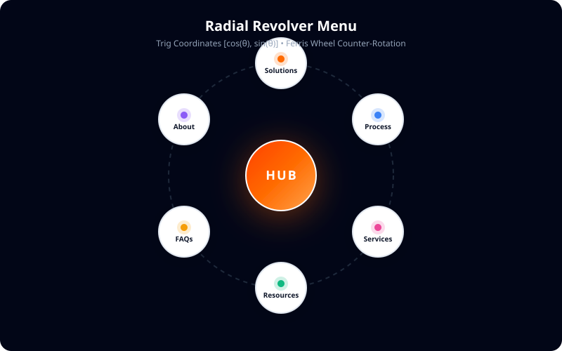

# Radial Revolver Menu

An animated radial navigation pattern built with **React**, **Tailwind CSS**, **Framer Motion**, and **Lucide React**.

Six navigation items orbit a central action in a circular layout, while coordinated rotation keeps every icon and label perfectly upright during the entrance animation.

> A UI pattern that combines trigonometry, motion design, and interaction engineering.

---

## Preview



---

## Architectural Tree

The component hierarchy is decomposed into focused, composable layers:

```text
RadialMenu
│
├── Backdrop
│
├── Radial Container
│   │
│   ├── Center Hub
│   │
│   └── Radial Wheel
│       │
│       ├── Pod
│       │   └── Counter Rotation
│       │
│       ├── Pod
│       │   └── Counter Rotation
│       │
│       └── ...
│
└── Interaction Layer
```

### Component Breakdown

| Component | Responsibility |
| --- | --- |
| **`Backdrop`** | Frosted-glass backdrop overlay, entrance/exit opacity transitions, body scroll lock, and Escape key dismissal. |
| **`RadialContainer`** | Circular coordinate plane driven by responsive CSS variables (`--radius`, `--pod-size`). |
| **`CenterHub`** | Central visual anchor with spherical gradient, scale, and spring entrance animation. |
| **`RadialWheel`** | The spinning orbital constellation rotating into place (`-360° -> 0°`) from origin coordinates. |
| **`Pod`** | Trigonometric coordinate positioning for each orbital item on the circumference. |
| **`CounterRotation`** | Inverse rotation (`+360° -> 0°`) preventing icons and labels from turning upside down (the Ferris Wheel effect). |
| **`InteractionLayer`** | Controls surrounding the wheel: Close button, header title/subtitle, annotation arrows, and footer controls. |

---

## The Core Concept

### 1. Trigonometric Positioning
Instead of manual pixel coordinates for each item, each item is assigned an orbital angle $\theta$ (in degrees):

```ts
const items = [
  { id: "1", title: "Solutions", angle: 270 }, // 12 o'clock (Top)
  { id: "2", title: "Process",   angle: 330 }, // 2 o'clock (Top-Right)
  { id: "3", title: "Services",  angle: 30  }, // 4 o'clock (Bottom-Right)
  { id: "4", title: "Resources", angle: 90  }, // 6 o'clock (Bottom)
  { id: "5", title: "FAQs",      angle: 150 }, // 8 o'clock (Bottom-Left)
  { id: "6", title: "About",     angle: 210 }, // 10 o'clock (Top-Left)
];
```

The position of each pod is calculated dynamically:

$$\text{rad} = \frac{\theta \cdot \pi}{180}$$

$$\text{left} = \text{calc}(50\% + \text{var(--radius)} \cdot \cos(\text{rad}) - \text{var(--pod-size)} / 2)$$

$$\text{top} = \text{calc}(50\% + \text{var(--radius)} \cdot \sin(\text{rad}) - \text{var(--pod-size)} / 2)$$

By using CSS variables `--radius` and `--pod-size`, the circle scales across mobile ($124\text{px}$), tablet ($175\text{px}$), and desktop ($205\text{px}$) with zero JavaScript resize listeners.

### 2. The "Ferris Wheel" Counter-Rotation Trick
When the parent `RadialWheel` rotates $-360^\circ$ into view, children naturally rotate with it. By applying an equal and opposite $+360^\circ$ rotation to `CounterRotation`, the two rotations cancel out:

- **Parent (`RadialWheel`)**: `initial={{ rotate: -360 }} animate={{ rotate: 0 }}`
- **Child (`CounterRotation`)**: `initial={{ rotate: 360 }} animate={{ rotate: 0 }}`

**Result**: The wheel orbits in a spiral, but every icon and label remains upright throughout the entire animation.

### 3. Trajectory Origin
Rather than expanding from the dead center of the viewport, the wheel can burst forth from a specific origin coordinate (such as a floating bottom navigation bar or menu button):

```ts
origin: { x: 90, y: 240 } // Coordinates relative to center
```

Using a snappy cubic-bezier curve (`ease: [0.16, 1, 0.3, 1]`), the animation feels mechanical and physical.

---

## Quick Start

### Installation

Clone the repository and install dependencies:

```bash
git clone https://github.com/Byanshuman/radial.git
cd radial
npm install
```

### Run the Interactive Demo

```bash
npm run dev
```

Visit `http://localhost:5173` to test the live playground with sliders for radius, pod diameter, and entrance trajectory.

---

## Usage in Your Project

Import `RadialMenu` and supply navigation items:

```tsx
import React, { useState } from "react";
import { RadialMenu, type RadialMenuItem } from "./RadialMenu";
import { Users, Workflow, Briefcase, BookOpen, HelpCircle, Info } from "lucide-react";

const items: RadialMenuItem[] = [
  { id: "1", title: "Solutions", icon: Users, angle: 270, iconColor: "text-orange-500" },
  { id: "2", title: "Process", icon: Workflow, angle: 330, iconColor: "text-blue-500" },
  { id: "3", title: "Services", icon: Briefcase, angle: 30, iconColor: "text-pink-500" },
  { id: "4", title: "Resources", icon: BookOpen, angle: 90, iconColor: "text-emerald-500" },
  { id: "5", title: "FAQs", icon: HelpCircle, angle: 150, iconColor: "text-amber-500" },
  { id: "6", title: "About", icon: Info, angle: 210, iconColor: "text-purple-500" },
];

export function Navigation() {
  const [isOpen, setIsOpen] = useState(false);

  return (
    <>
      <button onClick={() => setIsOpen(true)}>Open Menu</button>

      <RadialMenu
        isOpen={isOpen}
        onClose={() => setIsOpen(false)}
        items={items}
        headerTitle="Websites Engineered for Growth"
        centerContent={<span>HUB</span>}
        origin={{ x: 90, y: 240 }}
      />
    </>
  );
}
```

---

## API Reference

### `RadialMenuProps`

| Prop | Type | Default | Description |
| --- | --- | --- | --- |
| `isOpen` | `boolean` | **Required** | Controls open / closed state. |
| `onClose` | `() => void` | **Required** | Callback fired when the menu is dismissed. |
| `items` | `RadialMenuItem[]` | **Required** | The array of orbital pods to render. |
| `centerContent` | `React.ReactNode` | Optional | Custom content or logo rendered inside the central hub. |
| `headerTitle` | `React.ReactNode` | Optional | Headline text rendered in the top interaction layer. |
| `headerSubtitle` | `React.ReactNode` | Optional | Subtitle text below the header. |
| `footerContent` | `React.ReactNode` | Optional | Custom footer controls or status indicators. |
| `origin` | `{ x: number; y: number }` | `{ x: 0, y: 220 }` | Relative coordinate offset where the wheel emerges from. |
| `radius` | `number` | Responsive CSS | Explicit orbital radius in pixels. |
| `podSize` | `number` | Responsive CSS | Explicit diameter of each pod in pixels. |

### `RadialMenuItem`

| Property | Type | Description |
| --- | --- | --- |
| `id` | `string` | Unique identifier. |
| `title` | `string` | Primary label text. |
| `subtitle` | `string` | Optional supporting text. |
| `icon` | `React.ComponentType` | Icon component (e.g. Lucide icon). |
| `angle` | `number` | Orbital angle in degrees (0° = 3 o'clock, 90° = 6 o'clock, 270° = 12 o'clock). |
| `iconColor` | `string` | Tailwind text color class for the icon. |
| `href` | `string` | Optional URL navigation target. |
| `onClick` | `() => void` | Optional click callback. |
| `badge` | `string \| number` | Optional indicator badge. |

---

## License

MIT © [Anshuman Yadav](https://github.com/Byanshuman)
